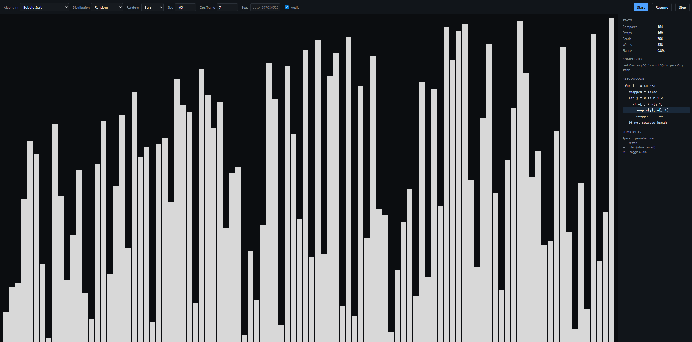

# sort-lab

> A pluggable, generator-based sorting algorithm visualizer. 18 sorts, 7 renderers, side-by-side compare mode, audio sonification, live stats, pseudocode highlighting — and zero build step.

[**Live demo →**](https://jeffeek.github.io/sort-lab/)



---

## Why

Most sort visualizers tangle algorithm logic with the DOM. This one doesn't. Algorithms are pure generators that yield abstract `Operation` objects; everything visible — bars, color wheels, scatter dots, sound, stats, pseudocode — is a downstream consumer of that op stream. The architecture is the point: adding a sort is a one-file change, and so is adding a new way to render one.

```
Algorithm ──yields──▶ Operation ──▶ Player ──▶ { Renderer | Sonifier | Stats | Pseudocode }
                                       └─ owns the array model
```

---

## Features

- **18 algorithms** across comparison, non-comparison, and specialty families.
- **7 interchangeable renderers** — DOM bars, mirrored pyramid, color wheel, scatter dots, color strip heatmap, polyline wave, Archimedean spiral.
- **Compare mode** — run multiple algorithms side-by-side on the same input, each in its own renderer, with synchronized or budget-paced playback.
- **Live pseudocode highlighting** — the active line tracks the running generator.
- **Stat counters** — compares, swaps, reads, writes, elapsed time.
- **Seedable PRNG** with 6 input distributions: random, nearly-sorted, reversed, few-unique, sawtooth, gaussian.
- **WebAudio sonification** — pitch maps to value; throttled so bursts don't melt your speakers.
- **First-class playback** — pause / step / resume, configurable ops-per-frame budget.
- **Persistent settings** — mode, algorithm, distribution, renderer, size, pacing, race duration, audio choice survive reload.
- **No build, no bundler** — vanilla ES modules, served straight off disk.

## Algorithms

| Family | Sorts |
|---|---|
| Comparison | bubble, cocktail, gnome, insertion, selection, shell, comb, quick, merge, heap, tim (simplified), intro |
| Non-comparison | radix (LSD, base 10), counting, bucket |
| Specialty | pancake, bitonic, bogo (capped) |

Every algorithm ships with complexity metadata and pseudocode. Pick any from the dropdown.

## Renderers

| Renderer | Best for |
|---|---|
| **Bars** | Classic view; range backdrops and pivot highlights |
| **Pyramid** | Bars mirrored about the centerline — symmetric silhouette, reads well in narrow panes |
| **Circular** | Hue encodes value, position encodes index — spotting symmetry and partitions |
| **Dots** | Reveals the diagonal of a sorted array; clearer than bars at large N |
| **Heatmap** | Single color strip; sortedness reads as a smooth left→right hue gradient |
| **Line** | Polyline plot of (i, value); unsorted = zigzag noise, sorted = clean monotone diagonal |
| **Spiral** | Each index sits along an Archimedean spiral, hue driven by value — visually striking |

## Compare mode

Switch the **Mode** dropdown to *Compare* to run multiple algorithms simultaneously on the **same input array, same seed, same size**. Each pane has its own algorithm and renderer; the shared controls (distribution, size, seed, ops/frame, start/pause) drive every pane in lockstep. The pane grid auto-sizes (cols × rows) to fit however many panes you add — capped at one pane per registered algorithm (no duplicates).

Two pacing modes:
- **Ops/frame** — every pane gets the same per-frame op budget. Algorithms with more ops take longer in wall-clock time. Honest visualization of relative work.
- **Synchronized** — pre-collects each algorithm's full op stream and plays them all back over a fixed wall-clock duration (default 15 s). All panes finish at the same time; each pane's header shows total ops and ops/sec, so the work disparity (e.g. bubble sort doing 50× more ops than quicksort to reach the same result) is right there next to the bars.

## Controls

| Action | Shortcut |
|---|---|
| Pause / resume | `Space` |
| Restart with current settings | `R` |
| Step one operation (while paused) | `→` |
| Toggle audio | `M` |

---

## Run locally

ES modules require an HTTP server (browsers block module loading from `file://`).

```bash
git clone https://github.com/Jeffeek/sort-lab.git
cd sort-lab
npm install        # pulls vitest + @playwright/test
npm start          # serves on http://localhost:8080
npm test           # vitest unit suite (algorithms, ops, data, registry, stats, settings, player)
npm run test:watch # vitest in watch mode
npm run test:e2e   # Playwright e2e (compare mode, persistence, hot-swap, race finish)
```

The app itself has no runtime dependencies — `npm start` just shells out to `http-server`. The e2e suite uses your system Chrome (`channel: 'chrome'` in `playwright.config.js`); switch to `'msedge'` if you only have Edge.

## Deploy to GitHub Pages

The repo is fully static — push `master` and point Pages at it:

1. **Settings → Pages → Source:** `Deploy from a branch`
2. **Branch:** `master` `/ (root)`
3. Wait a minute. Your demo lives at `https://Jeffeek.github.io/sort-lab/`.

No build action required.

---

## Architecture

The seam is `src/ops.js` — a small operation vocabulary (`compare`, `swap`, `read`, `write`, `mark`, `unmark`, `range`, `line`) that algorithms emit and consumers interpret. Algorithms never touch the DOM, audio, or stats; consumers never touch algorithm state.

```
src/
├── ops.js              — operation types + factory functions
├── registry.js         — algorithms self-register here
├── data.js             — seedable PRNG + input distributions
├── player.js           — RAF loop, pause/step/resume, budget + scheduled playback
├── pane.js             — one comparison pane: algo + renderer + stats + sonifier
├── stats.js            — counter sink
├── audio.js            — WebAudio sonifier (throttled)
├── settings.js         — localStorage k/v
├── renderer/
│   ├── index.js        — single source of truth for the RENDERERS map
│   ├── bar.js          — DOM bars
│   ├── pyramid.js      — canvas mirrored bars
│   ├── circular.js     — canvas color wheel
│   ├── dot.js          — canvas scatter
│   ├── heatmap.js      — canvas color strip
│   ├── line.js         — canvas polyline plot
│   └── spiral.js       — canvas Archimedean spiral
├── algorithms/
│   ├── index.js        — aggregator (one import line per sort)
│   └── <name>.js       — pure generator, exports { id, label, complexity, pseudocode, run }
└── app.js              — wires DOM ↔ everything; owns mode toggle + CompareManager
```

### Adding a sort

Drop a file in `src/algorithms/`:

```js
import { op } from '../ops.js';

export default {
    id: 'mysort',
    label: 'My Sort',
    complexity: { best: 'O(n)', average: 'O(n log n)', worst: 'O(n²)', space: 'O(1)', stable: false },
    pseudocode: ['for each pass …', '  yield op.compare …'],
    *run(a) {
        for (let i = 0; i < a.length; i++) {
            yield op.line(1);
            yield op.compare(i, i + 1);
            // …
        }
    },
};
```

Add one import line to `src/algorithms/index.js`. Done — it appears in the dropdown.

### Adding a renderer

Implement `mount(values)`, `apply(operation, values)`, `finale()`, `destroy()` in a new module under `src/renderer/`. Add one line to the `RENDERERS` map in `src/renderer/index.js`. Both the single-mode global renderer select and per-pane selects in Compare mode pick it up automatically.

### Player playback modes

- **Budget** — drains `opsPerFrame` operations per animation frame. Default; `Player.start(values, generator, { opsPerFrame, onDone })`.
- **Scheduled** — pre-collects an ops array and plays it back linearly over a target duration. Used by Compare mode's synchronized pacing so all panes finish together. `Player.startScheduled(values, ops, durationMs, { onDone })`.

Pause / resume / step / cancel work in both modes.

### Per-algorithm notes

Wiring details and pseudocode rationale for each sort live in [`docs/algorithms/`](docs/algorithms/).

---

## Tech notes

- **No build step.** The browser loads ES modules directly from `src/`. Refresh = redeploy.
- **No runtime dependencies.** Dev deps: vitest (unit) + @playwright/test (e2e).
- **RAF-budgeted playback.** Drains N ops per animation frame rather than one op per `setTimeout` — stays smooth at large N. A Web Worker variant was considered and intentionally deferred; the main thread stays responsive without it.
- **Synchronized race mode** pre-collects ops up-front (one drain pass per algorithm) so per-frame work is just time-indexed array reads. Memory cost is the op array per pane; bubble at N=200 is ~80k ops, comfortably bounded.
- **Renderer hot-swap.** Changing renderer mid-run does not cancel the player — the new renderer is mounted with the current mid-sort state and the run continues.
- **Seedable shuffles.** `mulberry32` PRNG; the same seed reproduces the same input array.
- **Test coverage.** 275 unit tests across algorithms, ops, data, registry, stats, settings, and player (budget + scheduled). 8 Playwright e2e tests for compare-mode flows, settings persistence, renderer hot-swap, and synchronized race.

## License

[`MIT`](LICENSE)
